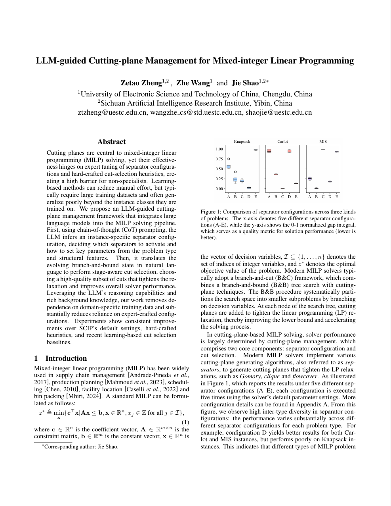

# LLM-guided Cutting-plane Management for Mixed-integer Linear Programming

[](https://www.python.org/)
[](https://scipopt.org/)
[](https://gitee.com/wang-zhihai/py-scipopt_-hem_-iclr2023)
[](https://www.ijcai.org/)

Official implementation of the paper:

**LLM-guided Cutting-plane Management for Mixed-integer Linear Programming**

Accepted by **IJCAI 2026**.

> Official proceedings link will be added once available.

---

## Paper

📄 [Read the paper](paper/LLM-guidedCutting-planeManagementforMixed-integerLinearProgramming.pdf)

<!-- Optional: show the first page of the paper as a preview image. -->
<!-- Convert the first page of the PDF to an image and place it at assets/paper_preview.png. -->

[](paper/LLM-guidedCutting-planeManagementforMixed-integerLinearProgramming.pdf)

---

## Overview

Mixed-integer linear programming (MILP) is widely used in supply chain management, production planning, scheduling, facility location, bin packing, and other combinatorial optimization tasks. Modern MILP solvers usually adopt a branch-and-cut framework, where cutting planes are used to tighten linear programming relaxations and accelerate the branch-and-bound search.

However, the effectiveness of cutting planes depends heavily on two key components:

1. **Separator configuration**: deciding which cut-generating separators should be activated and how their parameters should be set.
2. **Cut selection**: selecting a high-quality subset of candidate cuts during the solving process.

Existing solvers often rely on expert-designed rules and manually tuned parameters. Learning-based methods reduce manual effort but usually require large training datasets and may generalize poorly to unseen problem classes.

This repository implements an **LLM-guided cutting-plane management framework** that uses large language models to guide both separator configuration and cut selection for MILP solving.


---

## Repository Structure

```text
.
├── README.md
├── main.py
├── tools.py
├── paper/
│   └── LLM-guidedCutting-planeManagementforMixed-integerLinearProgramming.pdf
└── assets/
    └── paper_preview.png
```

---
## Requirements

### Python Dependencies

The basic Python dependencies are:

```text
Python 3.8
tqdm
requests
```

Install the required Python packages with:

```bash
pip install tqdm requests
```

### Solver Dependencies

This project depends on SCIP and PySCIPOpt:

```text
SCIP       8.0.0
PySCIPOpt  4.1.0
```

For the customized PySCIPOpt environment, please refer to:

```text
https://gitee.com/wang-zhihai/py-scipopt_-hem_-iclr2023
```

---

## LLM API

The implementation uses external LLM APIs. Please apply for an API key before running the code.

Supported API platforms include:

- SiliconFlow: https://cloud.siliconflow.cn/
- OpenRouter: https://openrouter.ai/

---

## Running the Code

Example command:

```bash
python main.py --dataset setcover --mode ai
```

Arguments:

```text
--dataset   Dataset name, such as setcover.
--mode      Solving mode. Use ai to enable LLM-guided cutting-plane management.
```

---

## Datasets

The benchmark datasets can be found at:

```text
https://drive.google.com/drive/folders/1LXLZ8vq3L7v00XH-Tx3U6hiTJ79sCzxY?usp=sharing
```

The paper evaluates the proposed method on five MILP benchmark classes:

- Set Covering
- Maximum Independent Set
- Multiple Knapsack
- MIK
- CORLAT
